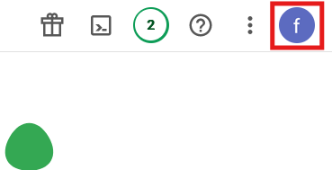

    <h1>Configuring the API credentials</h1>

## Chose an accont

As indicated in the README, you need to go on the [Google Cloud Platform](https://console.cloud.google.com/).

Then you need to chose the account with which you want to connect thanks to the bubble account

    

## Go to APIS and services

Then on the welcome page you need to go on the "APIs & services" tab.

    

## Enable the Google Drive API

You should arrived on this kind of page. You need to click on this link.

    

You should arrive on this page on which you need to scroll a bit to find the Google Drive API

    

    

Enable the the Google Drive API.

    

    

Set everything like this and click next

    

