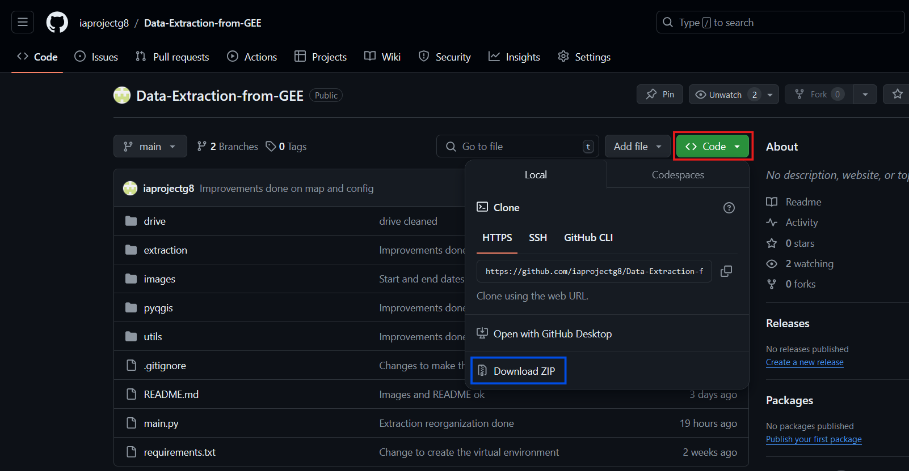

<div style="text-align: center;">
    <h1>Data extraction</h1>
</div>


This application allows you to extract Land Surface Temperature (LST) data for a given study area using Google Earth Engine and display it using a web-based interface. I recommend you to read the whole REAMDE before to install anything, to know exactly what you have to do.

## Features

- Authenticate with Google Earth Engine
- Extract LST data for the specified area and time period
- Visualize the data on an interactive map
- Launch and stop data export tasks to Google Drive
- Chose the local path to make the download
- Download the files from the drive
- Convert all the downloaded files into a CSV with all the informations


## Setup

If you don't have python, you can go to the Microsoft Store and download `Python 3.11` or `Python 3.12`. Something else imoprtant: **In the terminal if you don't see the path of your location in the computer, it means the precedent command is not finished yet.** This is important for the virtual environment setup, because the installation of python package can be quite long.

1. **Download ZIP**: 
Downlaod the zip version of this project. To do this you need to be on the [GitHub project page](https://github.com/iaprojectg8/Data-Extraction-from-GEE):
- Click on **Code**
- Click on **Donwload ZIP** 



2. **Exract file**: After downloading the zip file, **extract** it in the location you want on your computer.

3. **Open Terminal or CMD**: Go to the extracted location and open the folder in your **terminal** or **CMD**. To do this you can right click and the folder **`Data-Extraction-from-GEE-main`** and chose **`Open in Terminal`**. If the right click does not provide you this option, you can write `cmd` in the address bar, like on the following video.


4. **Create a python virtual environment**:

```
python -m venv extractenv
```

5. **Activate it**:
```
extractenv\Scripts\activate
```

6. **Install the dependencies**:
```
pip install -r requirements.txt
```


## Project

If you don't want to bother with the configuration of a Google account, there is already one that exist for Groupe Huit. You need to go to the connection page of Google and give the following credentials: email:`g8tool@gmail.com` and password: `groupe_huit_nantes`. This will connect you to the G8 account.


## OSGeo4W
You need to install and setup OSGeo4W if you don't have it. In case you have it you can try the following instruction. If, after those instruction, it does not work, don't hesitate to reinstall OSGeo4W. In case you don't have at least the following package in the location of you QGIS, you should maybe think about a reinstall. 


<div style="text-align: center;" >
    
</div>

An express install should be enough, it should contain everything you need.


You can watch this video, it is quite well explained, but **you should not** have the same version as the guy who explains, so you should not look for the QGIS folder but instead for the **`OSGeo4W`** one which **have to be** at the root of your computer (default installation location during the setup is `C:\OSGeo4W`, keep it, if you change it it will not work).

[](https://www.youtube.com/watch?v=9i16cFZy5M4&t=149s)

If you did not understand well the video here is a summary of what is explained in it.

1. First you should go to the python configuration of your OSGeo4W to make a copy of the python executable for QGIS and give it the name **`pythonq`**. If you don't rename it like this it will **not work**. Indeed if you don't change the name of the python executable, it may never be called as you may have another python version out of QGIS. It should be in a similar directory as this one:


2. Then you should go to the environment variables. Try typing it in the Windows search bar and click on `Modifier les variables d'environnement pour votre compte`.


4. You need to modify the `Path` or `PATH` variable, you should **Add** those paths:


5. For the `PYTHONPATH` variable, if it does not exist create it, and then add these paths: 

If you did everything right, you should be able to convert all the files downloaded in one CSV file.

## Execution
To execute the program, still in the terminal or command prompt run this :
```
python main.py
```

From this each time the program will open a window to select a Google account, you will have to chose the G8 one, `g8tool@gmail.com`. If you did the connection before, as it was indicated you will not have to put the password again, if you did not, put the password when it is asked. Also each time Google will ask authorization, you will accept, clicking on `Continue`.

Also for the **`Download`** part, don't forget to change the path with one of your choice, of course one that exists. 

Finally for the conversion part, you if did everything well, it should create two folders inside of your downloaded one, named `Data` and `Results`. In the data, there are all the images extracted and downloaded from the drive in the TIF format. In the `Results` one, you should have only the CSV file

## The App
On the application, you have 2 main parts, the parameters and the map. Select your own parameters.

Then use the drawing tool of the map and make a zone on which you want to extract data from. If there is data it will show you an LST visualization of your selected zone. Unfortunately, depending on your selected parameters it is possible that no data is available. Thus you need to change them to have something to extract (cloud cover, coverage percentage or date interval are the best parameters to change if you don't have any data).

Thus you can extract the data with the button or draw another zone. If you need to stop the extraction during the process don't hesitate to click on the "Stop" button.

Moreover, you can download the folder containing all the exported data, that are stored on the drive. You just need to click on the button. If it is the first time that you make the app run, you will have to connect to your Google account linked to the GEE project to be able to download. Of course, if you don't use G8 credentials or you did not follow my guide to create your credentials, you will not be able to download, you will get an error when connecting. 

Finally, you can convert all the TIF file you downloaded into one CSV file. Each columns will be the data from one TIF file.

Here is a brief video on how you can use the app.


[](https://www.youtube.com/watch?v=u-F7HcA686E)


## To go further

If you exceed the amount of requests that you can do on Google Earth Engine, you can create another Google account and reconfigure the Google credentials.


### Earth engine project
First if you do not have any Google Earth Engines project, you need to create one. To do this I recommend you to watch this video:

[](https://www.youtube.com/watch?v=nbSafTubU14)


### Drive
In order to get the files on your local computer, you can download them from the app. But to be able to do that you need to get your own credentials, from the [Google Cloud Platform](https://console.cloud.google.com/). Watch this video to configure your drive and credentials properly. 

[](https://www.youtube.com/watch?v=BDu-uKlADxs )


Then if you have already launched the app with the G8 account, you just need to substitute the G8 credentials by your own.