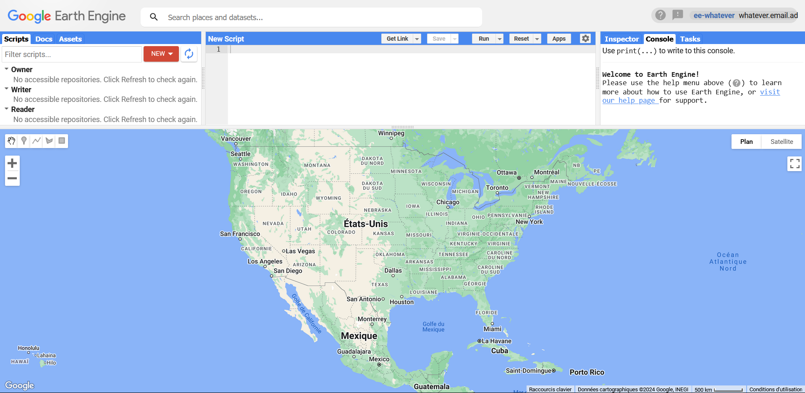
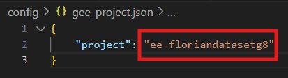
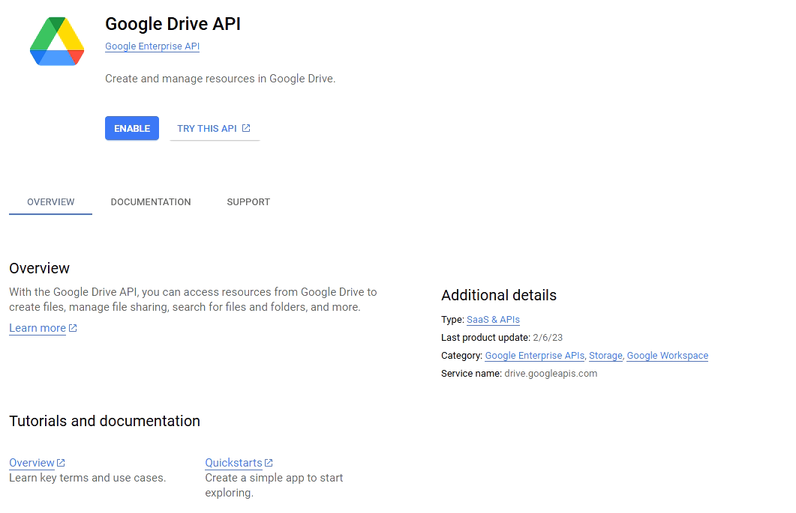
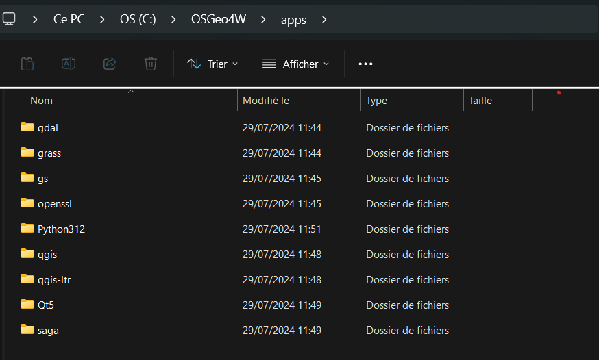
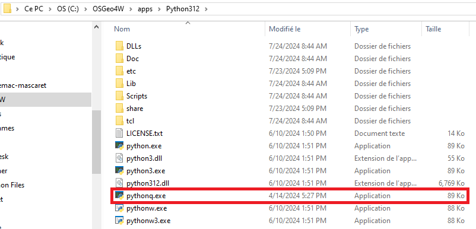
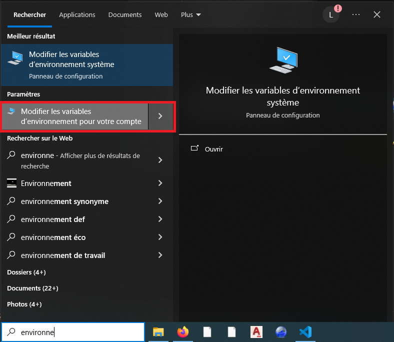
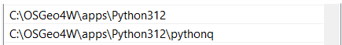
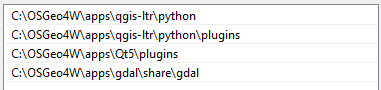
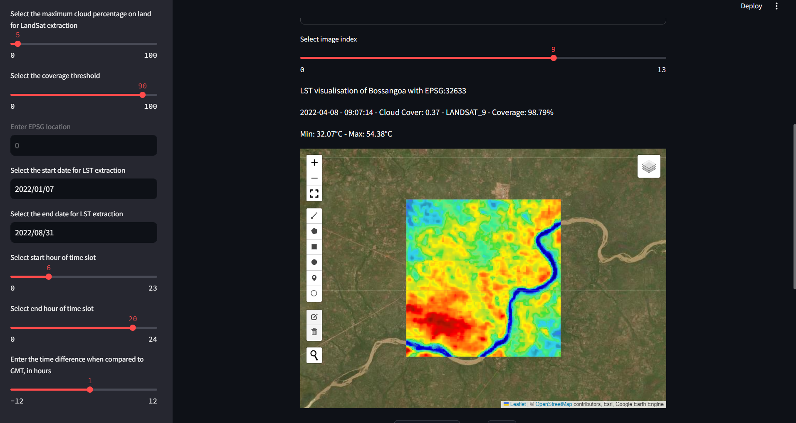

<div style="text-align: center;">
    <h1>Data extraction</h1>
</div>


This application allows you to extract Land Surface Temperature (LST) data for a given study area using Google Earth Engine and display it using a web-based interface. I recommend you to read the whole REAMDE before to install anything, to know exactly what you have to do.

## Features

- Authenticate with Google Earth Engine
- Extract LST data for the specified area and time period
- Visualize the data on an interactive map
- Launch and stop data export tasks to Google Drive
- Chose the local path to make the download
- Download the files from the drive
- Convert all the downloaded files into a CSV with all the informations

## Prerequisites

Make sure you have the following :

- Python 3.7 or higher
- Google Cloud project
- OSGeo4W with QGIS installed

## Setup


1. **Create a virtual environement**:
Open a command prompt or a terminal and create a virtual environment:
```
python -m venv yourenvname
```

2. **Activate it**:
```
yourenvname\Scripts\activate
```
4. **Install the dependencies**:
```
pip install -r requirements.txt
```

## Project

First if you do not have any Google Earth Engines project, you need to create one. To do this I recommend you to watch this video:
[](https://www.youtube.com/watch?v=nbSafTubU14)


Finally to make the process work you need to put your Earth Engine project name into the file [utils/gee_project.json](utils/gee_project.json), the name of your project instead of mine.
In the location said change the string framed in red.

<div style="text-align: center;" >
    
</div>

## Drive
In order to get the files on your local computer, you can download them from the app. But to be able to do that you need to get your own credentials, from the [Google Cloud Platform](https://console.cloud.google.com/). Watch this video to configure your drive and credentials properly. 

[](https://www.youtube.com/watch?v=BDu-uKlADxs )


## OSGeo4W
You need to install and setup OSGeo4W if you don't have it. In case you have it you can try the following instruction, but in case it does not work, don't hesitate to reinstall it. In case you don't have at least the following package in the location of you QGIS, you should maybe think about a reinstall. 


<div style="text-align: center;" >
    
</div>

An express install should be enough, it should contain everything you need.


You can watch this video, it is quite well explained, but you should not have the same version as the guy who explains, so you<> should not look for the QGIS folder but instead for the OSGeo4W one which is usually at the root of your computer (default installation location during the setup) or at the location you installed it.

[](https://www.youtube.com/watch?v=9i16cFZy5M4&t=149s)

If you did not understand well the video here is a summary of what is explained in it.

1. First you should go to the python configuration of your OSGeo4W to make a copy of the python executable of QGIS and give it a name that you would recognize easily. Here as you can see I renamed it `pythonq` to ease the call then. Indeed if you don't change the name of the python executable, it may never be called as you may have another python version out of QGIS. It should be in a similar directory as this one:


2. Then you should go to the environment variables. Try typing it in the Windows search bar and click on `Modifier les variables d'environnement pour votre compte`, because pyqgis does not require to have special privileges to run it. For the following, I need to warn you, the paths I put in my variables correspond to my system configuration and especially the OSGeo4W configuration. If you did not install OSGeo4W at the same location as me, the paths will change a bit.


3. From here you should navigate to the configuration file for the python executable for pyqgis, [pyqgis/utils/python_executable.json](pyqgis/utils/python_executable.json), and put your own python executable for QGIS, if it is not called `pythonq`.

4. For the `Path` or `PATH` variable, you should **Add** those kind of paths:



5. For the `PYTHONPATH` variable, if it does not exist create it, and then add these paths: 

If you did everything right, you should be able to convert all the files downloaded in one CSV file.

## Execution
To execute the program, still in the command prompt run this :
```
python main.py
```

## The App
On the application, you have 2 main parts, the parameters and the map. Select your own parameters.

Then use the drawing tool of the map and make a zone on which you want to extract data from. If there is data it will show you an LST visualization of your selected zone. Unfortunately, depending on your selected parameters it is possible that no data is available. Thus you need to change them to have something to extract (cloud cover, coverage percentage or date interval are the best parameters to change if you don't have any data).

Thus you can extract the data with the button or draw another zone. If you need to stop the extraction during the process don't hesitate, the "Stop" button is in this purpose.

Finally, you can download the folder containing all the exported data, that are stored on the drive. You just need to click on the button. If it is the first time that you make the app run, you will have to connect to your Google account linked to the GEE project to be able to download. Of course, if you did not follow my guide to create your credentials, you will not be able to download, you will get an error when connecting. 

Here is a brief video on how you can use the app.


[](https://www.youtube.com/watch?v=u-F7HcA686E)