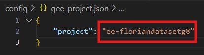

<div style="text-align: center;">
    <h1>Data extraction</h1>
</div>


This application allows you to extract Land Surface Temperature (LST) data for a given study area using Google Earth Engine and display it using a web-based interface.

## Features

- Authenticate with Google Earth Engine
- Extract LST data for the specified area and time period
- Visualize the data on an interactive map
- Launch and stop data export tasks to Google Drive
- Download the files from the drive
- Chose the local path to make the download

## Prerequisites

Make sure you have the following :

- Python 3.7 or higher
- Google Cloud project

## Setup


1. **Create a virtual environement**:
Open a command prompt or a terminal and use virtualenv, if you don't have it install it:
```
pip install virtalenv
```
Then you need to create it :
```
virtualenv yourenvname
```
2. **Activate it**:
```
yourenvname\Scripts\activate
```
4. **Install the dependencies**:
```
pip install -r requirements.txt
```

## Project
Finally to make the process work you need to put your Earth Engine project name into the file `extraction/gee_project.json`, the name of your project instead of mine.
In the location said change the string framed in red.

<div style="text-align: center;" >
    
</div>


## Execution
To execute the program, still in the command prompt run this :
```
python main.py
```

## Drive
In order to get the files on your local computer, you can download them from the app. But to be able to do that you need to get your own credentials, from the [Google Cloud Platform](https://console.cloud.google.com/). I let you read the document I have made for this.
## The App
On the application, you have 2 main parts, the parameters and the map. Select your own parameters.

Then use the drawing tool of the map and make a zone on which you want to extract data from. If there is data it will show you an LST visualization of your selected zone. Unfortunately, depending on your selected parameters it is possible that no data is available. Thus you need to change them to have something to extract.

Finally you can extract the data with the button or draw another zone.